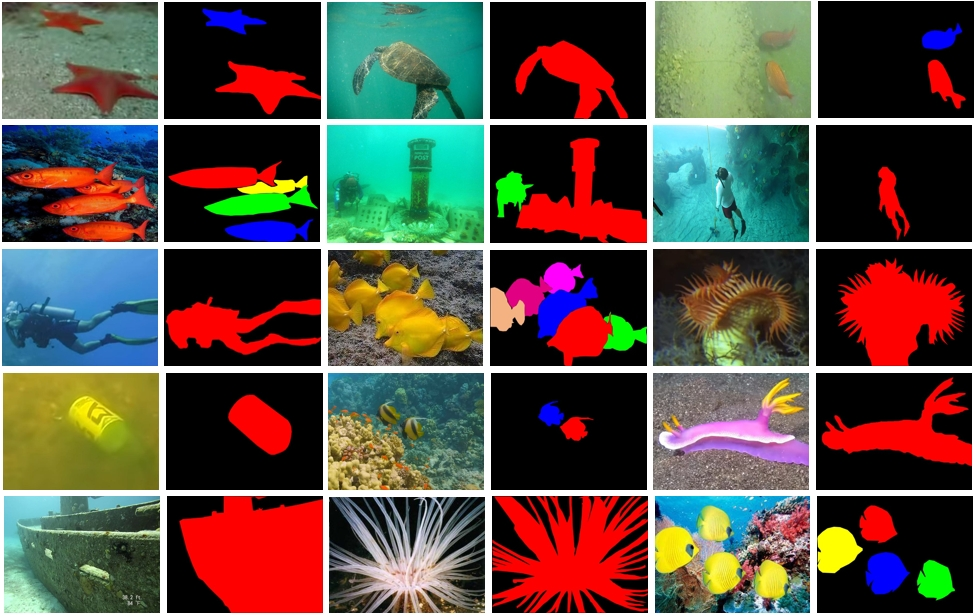
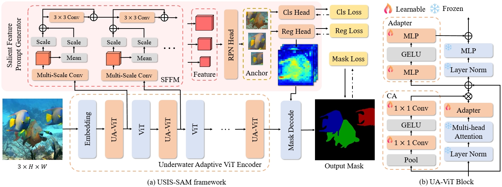

# USIS10K & USIS-SAM


This repository is the official implementation of "[Diving into Underwater: Segment Anything Model Guided Underwater Salient Instance Segmentation and A Large-scale Dataset](https://openreview.net/pdf?id=snhurpZt63)".

If you found this project useful, please give us a star ⭐️ or [cite](#citation) us in your paper, this is the greatest support and encouragement for us.

## :speech_balloon: Updates
🚩 **News** (2024.05) This paper has been accepted as a paper at [**_ICML 2024_**](https://openreview.net/forum?id=snhurpZt63), receiving an **average rating of 6 with confidence of 4.25**.

## :rocket: Highlights:
- **USIS10K dataset**: We construct the first large-scale USIS10K dataset for the underwater salient instance segmentation task, which contains 10,632 images and pixel-level annotations of 7 categories. As far as we know, this is the **largest salient instance segmentation dataset** available that simultaneously includes Class-Agnostic and Multi-Class labels.
  
  
- **SOTA performance**: We first attempt to apply SAM to underwater salient instance segmentation and propose **USIS-SAM**, aiming to improve the segmentation accuracy in complex underwater scenes. Extensive public evaluation criteria and large numbers of experiments verify the effectiveness of our USIS10K dataset and USIS-SAM model.
 
  

## Installation

### Requirements
* Python 3.7+
* Pytorch 2.0+ (we use the PyTorch 2.1.2)
* CUDA 12.1 or other version
* mmengine
* mmcv>=2.0.0
* [MMDetection](https://mmdetection.readthedocs.io/en/latest/get_started.html) 3.0+

### Environment Installation
<details>
<summary>Install on Environment</summary> <br/> 

**Step 0**: Download and install [Miniconda](https://docs.conda.io/projects/miniconda/en/latest/index.html) from the official website.

**Step 1**: Create a conda environment and activate it.

```shell
conda create -n usis python=3.9 -y
conda activate usis
```

**Step 2**: Install [PyTorch](https://pytorch.org/get-started/previous-versions/#v212). If you have experience with PyTorch and have already installed it, you can skip to the next section. 

**Step 3**: Install MMEngine, MMCV, and MMDetection using MIM.

```shell
pip install -U openmim
mim install mmengine
mim install "mmcv>=2.0.0"
mim install mmdet
```

**Step 4**: Install other dependencies from requirements.txt
```shell
pip install -r requirements.txt
```

</details>

## Datasets

Please create a `data` folder in your working directory and put USIS10K in it for training or testing, or you can just change the dataset path in the [config file](project/our/configs). If you want to use other datasets, you can refer to [MMDetection documentation](https://mmdetection.readthedocs.io/en/latest/user_guides/dataset_prepare.html) to prepare the datasets.

    data
      ├── USIS10K
      |   ├── foreground_annotations
      │   │   ├── foreground_train_annotations.json
      │   │   ├── foreground_val_annotations.json
      │   │   ├── foreground_test_annotations.json
      │   ├── multi_class_annotations
      │   │   ├── multi_class_train_annotations.json
      │   │   ├── multi_class_val_annotations.json
      │   │   ├── multi_class_test_annotations.json
      │   ├── train
      │   │   ├── train_00001.jpg
      │   │   ├── ...
      │   ├── val
      │   │   ├── val_00001.jpg
      │   │   ├── ...
      │   ├── test
      │   │   ├── test_00001.jpg
      │   │   ├── ...

you can get our USIS10K dataset in [Baidu Disk](https://pan.baidu.com/s/1dsyRvGADZD43MwrNHlNIdw?pwd=icml) (pwd:icml) or [Google Drive](https://drive.google.com/file/d/1LdjLPaieWA4m8vLV6hEeMvt5wHnLg9gV/view?usp=sharing).

## Model Zoo
|Model|Test|Epoch    | mAP        | AP50      |AP75      |   config |   download |
|:---:|:--:|:-------:|:----------:|:---------:|:--------:|:--------:|:----------:|
|USIS-SAM|Class-Agnostic|24|64.3|84.9|74.0|[config](project/our/configs/foreground_usis_train.py)|[Baidu](https://pan.baidu.com/s/1SbNQxnNIq8Sv3dyUsWMYGw?pwd=x2am) (pwd:x2am) / [Google](https://drive.google.com/file/d/1g2qcxLLHYwUDhmsXz4ZxMHJRl3lY-oxY/view?usp=drive_link)|
|USIS-SAM|Multi-Class|24|43.9|59.6|50.0|[config](project/our/configs/multiclass_usis_train.py)|[Baidu](https://pan.baidu.com/s/17kMQQx_DmVLGjEBVtZfUgg?pwd=tv3z) (pwd:tv3z) / [[Google](https://drive.google.com/file/d/1suvKpSp83Ied9UjVQElcCEdGvR5ekA5m/view?usp=drive_link)|

Note: We optimized the code and data augmentation strategy of USIS-SAM without substantial changes to make it more efficient for training and inference, so the results here are slightly higher than the experiments in the paper.

## Model Training

### Download SAM model weights from huggingface

We provide a simple [script](pretrain/download_huggingface.sh) to download model weights from huggingface, or you can choose another source to download weights.

```shell
cd pretrain
bash download_huggingface.sh facebook/sam-vit-huge sam-vit-huge
cd ..
```

After downloading, please modify the model weight path in the [config](project/our/configs/anchor_net.py#L57) file.

### Training

You can use the following command for single-card training.

```shell
python tools/train.py project/our/configs/multiclass_usis_train.py
```

Or you can use the following command for multi-card training.

```shell
bash tools/dist_train.sh project/our/configs/multiclass_usis_train.py nums_gpu
```

For more ways to train or test please refer to [MMDetection User Guides](https://mmdetection.readthedocs.io/en/latest/user_guides/index.html#useful-tools), we provide you with their [tools](tools/) toolkit and [test](tests/) toolkit in the code!

## Visualization

If you want to visualize the inference results, you can use [vis_infer.py](vis_infer.py).

Specifically, if you are using the [pth file](https://pan.baidu.com/s/17kMQQx_DmVLGjEBVtZfUgg?pwd=tv3z) we published, you will also need to use [add_classes.py](add_classes.py) to add class mateinfo to the pth file.

These two files were provided by Kaiying Han[@original-doc](https://github.com/original-doc), thanks for his contribution to this project!

## Citation
If you find our repo or USIS10K dataset useful for your research, please cite us:
```
@inproceedings{
  lian2024diving,
  title={Diving into Underwater: Segment Anything Model Guided Underwater Salient Instance Segmentation and A Large-scale Dataset},
  author={Shijie Lian and Ziyi Zhang and Hua Li and Wenjie Li and Laurence Tianruo Yang and Sam Kwong and Runmin Cong},
  booktitle={Forty-first International Conference on Machine Learning},
  year={2024},
  url={https://openreview.net/forum?id=snhurpZt63}
}
```

## Acknowledgement
This repository is implemented based on the [MMDetection](https://github.com/open-mmlab/mmdetection) framework and [Segment Anything Model](https://huggingface.co/facebook/sam-vit-huge). In addition, we referenced some of the code in the [RSPrompter](https://github.com/KyanChen/RSPrompter/tree/lightning) repository. Thanks to them for their excellent work.

## ⭐ Stargazers
[](https://github.com/LiamLian0727/USIS10K/stargazers)


